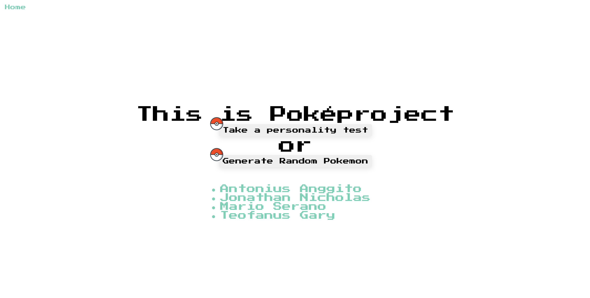
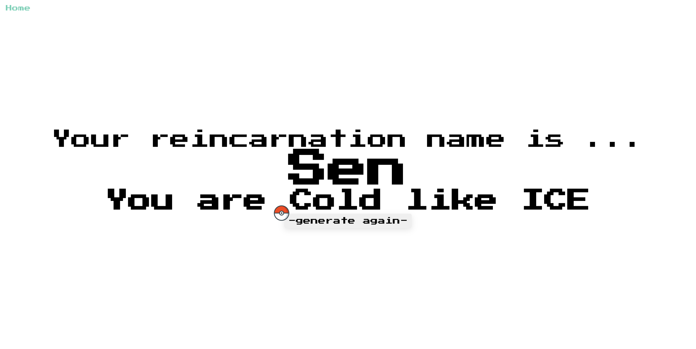

# Fullstack Pokemon Generator using Sringboot and Thymeleaf







## Backend Endpoints!

- /questions
  > methods = [GET, POST]
- /questions/{id}
  > methods = [PUT, DELETE]

## Frontend Endpoints!

- /
  > Homepage styled and animated with css and themed with css variables
- /generate
  > Generate random pokemon with nature mapping explained
- /pokeform
  > Form with data from backend endpoint (/questions)

## John Teo G. Moore Contributors

- Antonius Anggito
- Jonathan Nicholas
- Mario Serano
- Teofanus Gary

## Tech

Pokeproject uses the following:

- [Springboot] - Backend API
- [Thymeleaf] - Frontend

## Installation

Pokeproject requires Gradle / Maven and Springboot to run

```sh
$ cd pokeproject
$ ./gradlew bootrun
```

All set!

### Contributing

Want to contribute? Great!

Special thanks to Fariz Darari, S.Kom, M.Sc., Ph.D. as our Foundations of Programming lecturer for this semester.
